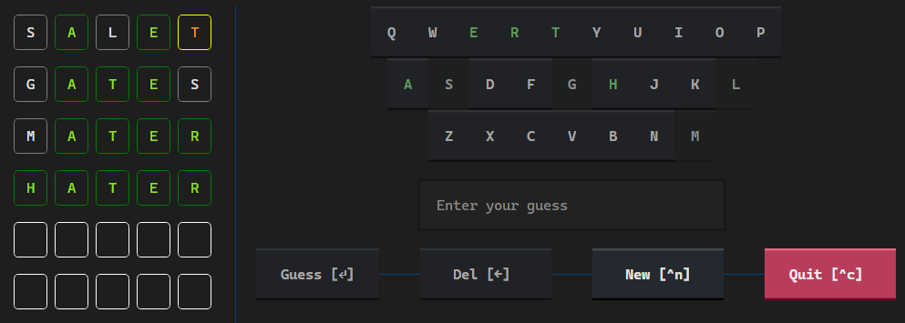
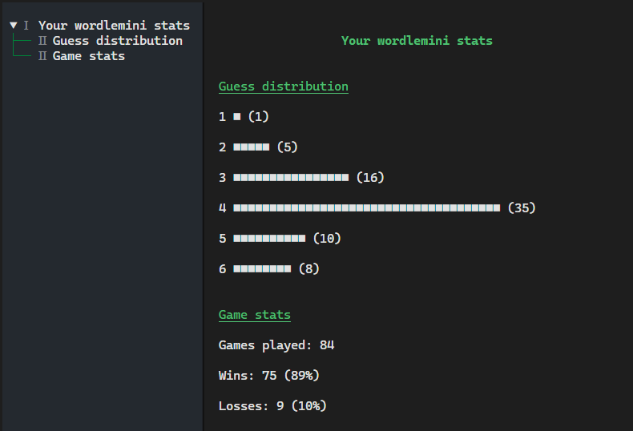

<div align="center">

# wordlemini

</div>

<div align="center">



[](https://pypi.org/project/wordlemini/)
[](https://github.com/tomasvana10/wordlemini/actions/workflows/publish.yml)
[](https://github.com/tomasvana10/wordlemini/releases/latest)
[](https://github.com/tomasvana10/wordlemini/issues)
[](https://github.com/tomasvana10/wordlemini/actions/workflows/github-code-scanning/codeql)
[](https://github.com/tomasvana10/wordlemini/actions/workflows/tox-tests.yml)

</div>

`wordlemini` is a TUI package that allows you to play wordle in the command-line using `Textual`.

- Download the latest source code [here](https://github.com/tomasvana10/wordlemini/releases/latest).
- Available languages: Czech, German, English, Spanish, French, Italian, Dutch, Portugese, Russian

### Installation
Install the package from PyPI (a virtual environment is recommended):
```
pip install wordlemini
```

Run the game:
```
wordlemini
```

### CLI
**arguments**

- config
  - lang `<lang-code>` - Change the language.
  - dark `<on/off>` - Turn dark mode or on off.

Example: 
```
wordlemini config lang ru
```

- stats - View your stats, including your guess distribution and games played.

### Runtime dependencies
`textual` `platformdirs` `pycountry`

### Acknowledgements
[textual](https://textual.textualize.io/) - A Rapid Application Development framework for Python.

[platformdirs](https://pypi.org/project/platformdirs/) - Finding the right place to store user data, independent to the OS.

[pycountry](https://pypi.org/project/pycountry/) - ISO databases for languages

### Gallery
*Stats TUI*


